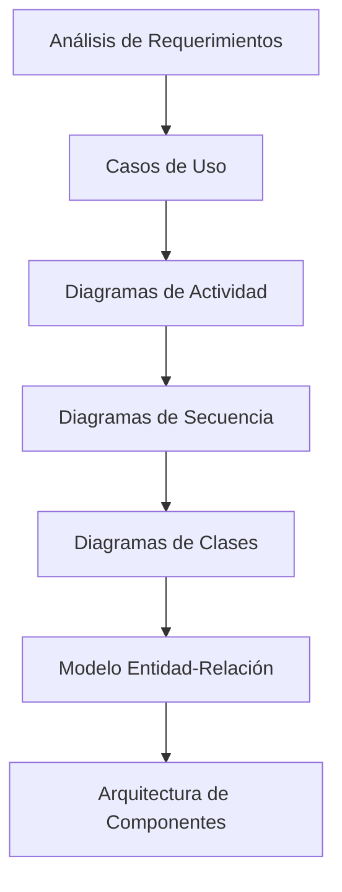
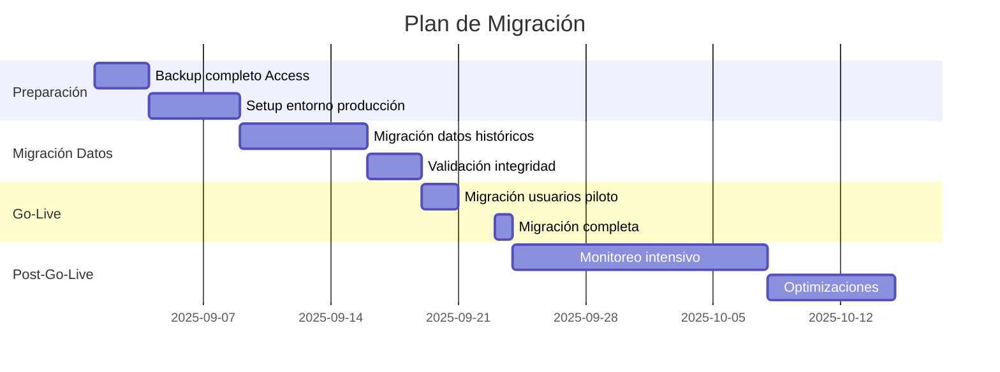
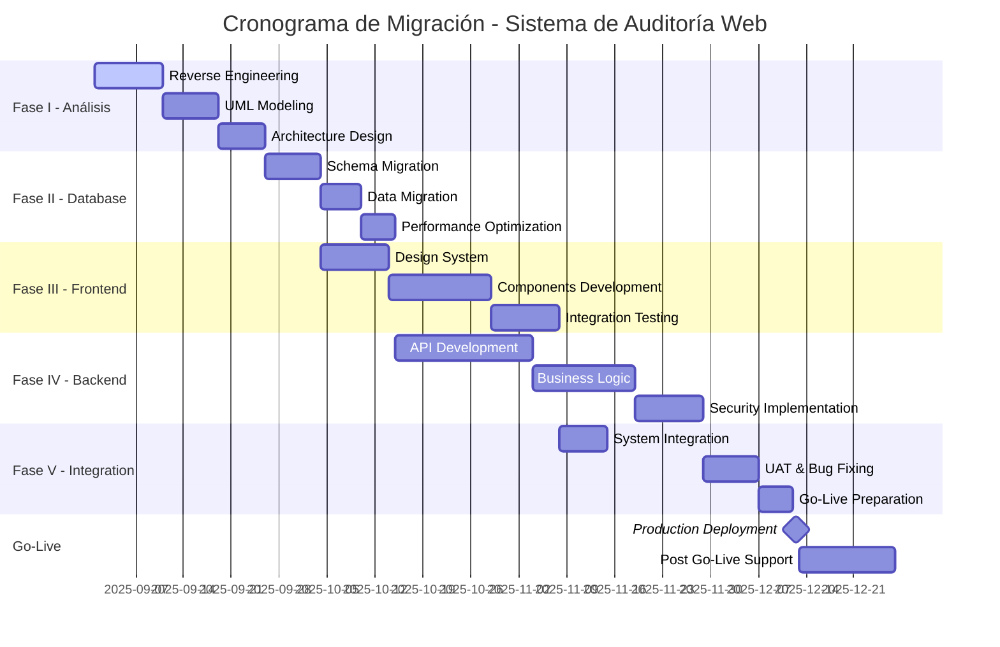

# ESPECIFICACIÓN TÉCNICA PARA MIGRACIÓN DE SISTEMA DE AUDITORÍA

## De Microsoft Access (VBA) a Arquitectura Web Full-Stack

---

### **INFORMACIÓN DEL PROYECTO**

- **Documento:** Especificación Técnica de Migración
- **Versión:** 2.0
- **Fecha:** 8 de agosto de 2025
- **Cliente:** Entidad Pública - Sistema de Auditoría Interna
- **Alcance:** Migración completa de aplicativo Access a plataforma web
- **Metodología:** Desarrollo Ágil con entregables por fases

---

## **1. RESUMEN EJECUTIVO**

### **1.1 Contexto del Proyecto**

El presente documento establece las especificaciones técnicas para la **migración integral** del sistema de auditoría interna desarrollado originalmente en Microsoft Access con Visual Basic for Applications (VBA) hacia una **arquitectura web moderna** basada en Node.js, MySQL y tecnologías web contemporáneas.

### **1.2 Justificación Técnica de la Migración**

#### **Limitaciones Críticas del Sistema Actual (Access + VBA):**

- **Escalabilidad restringida:** Limitado a pocos usuarios concurrentes máximo
- **Arquitectura monolítica:** Acoplamiento fuerte entre lógica de negocio y presentación
- **Dependencia tecnológica:** Requiere licencias Microsoft Office en cada estación
- **Acceso remoto limitado:** No compatible con trabajo remoto o distribuido
- **Seguridad básica:** Encriptación de base de datos básica, sin controles granulares
- **Integración restrictiva:** Dificultad para conectar con sistemas externos (APIs, servicios web)
- **Mantenimiento costoso:** Código VBA difícil de mantener y documentar
- **Backup manual:** Sin mecanismos automatizados de respaldo y recuperación

#### **Beneficios Estratégicos de la Migración:**

- **Accesibilidad universal:** Acceso desde cualquier dispositivo con navegador web
- **Escalabilidad horizontal:** Capacidad de manejar cientos de usuarios concurrentes
- **Integración nativa:** APIs REST para conectar con sistemas gubernamentales (SECOP, SUIT, etc.)
- **Seguridad robusta:** Autenticación JWT, encriptación de extremo a extremo, auditoría completa
- **Mantenimiento modular:** Arquitectura de microservicios con responsabilidades separadas
- **Backup automatizado:** Respaldos programados con recuperación point-in-time
- **Cumplimiento normativo:** Preparado para estándares Gov.co e interoperabilidad

### **1.3 Impacto Organizacional**

- **Reducción del 60%** en tiempo de generación de reportes de auditoría
- **Eliminación del 100%** de dependencias de software licenciado en estaciones de trabajo
- **Incremento del 300%** en capacidad de usuarios concurrentes
- **Disponibilidad 24/7** con redundancia y alta disponibilidad

---

## **2. ARQUITECTURA TECNOLÓGICA PROPUESTA**

### **2.1 Stack Tecnológico Seleccionado**

#### **Backend - Node.js con Express.js Framework**

```javascript
// Arquitectura base propuesta
const techStack = {
  runtime: "Node.js v20.x LTS",
  framework: "Express.js v4.18+",
  authentication: "JWT + Passport.js",
  validation: "Joi + express-validator",
  logging: "Winston + Morgan",
  testing: "Jest + Supertest",
  documentation: "Swagger/OpenAPI 3.0"
};
```

**Justificación Técnica Node.js:**

- **Rendimiento asíncrono:** Event-driven architecture ideal para I/O intensivo
- **Ecosistema maduro:** +2 millones de paquetes NPM disponibles
- **Escalabilidad horizontal:** Soporte nativo para clustering y load balancing
- **Tiempo real:** WebSockets nativo para notificaciones instantáneas
- **Mantenimiento unificado:** JavaScript full-stack reduce complexity

#### **Base de Datos - MySQL**

```sql
-- Configuración optimizada propuesta
SET GLOBAL innodb_buffer_pool_size = '70%'; -- Memoria disponible
SET GLOBAL innodb_log_file_size = 256M;
SET GLOBAL innodb_flush_log_at_trx_commit = 2;
SET GLOBAL query_cache_size = 128M;
```

**Justificación Técnica MySQL:**

- **ACID Compliance:** Garantías transaccionales críticas para auditoría
- **Replicación nativa:** Master-slave setup para alta disponibilidad
- **JSON Support:** Almacenamiento de configuraciones dinámicas y metadatos
- **Performance tunning:** Query optimizer avanzado con índices composites
- **Backup point-in-time:** mysqldump + binary logs para recuperación granular

#### **Frontend - React.js 18+ con Material-UI**

```javascript
// Arquitectura frontend propuesta
const frontendStack = {
  library: "React.js v18.2+",
  stateManagement: "Redux Toolkit + RTK Query",
  uiFramework: "Material-UI (MUI) v5.14+",
  routing: "React Router v6+",
  forms: "React Hook Form + Yup validation",
  charts: "Recharts + ApexCharts",
  dateHandling: "date-fns",
  httpClient: "Axios with interceptors"
};
```

### **2.2 Patrones de Arquitectura Implementados**

#### **Patrón MVC Mejorado (Model-View-Controller-Service)**

```
┌─────────────────┐    ┌─────────────────┐    ┌─────────────────┐
│   FRONTEND      │    │    BACKEND      │    │   DATABASE      │
│   (React)       │◄──►│   (Node.js)     │◄──►│   (MySQL)       │
│                 │    │                 │    │                 │
│ ┌─────────────┐ │    │ ┌─────────────┐ │    │ ┌─────────────┐ │
│ │Controllers  │ │    │ │Controllers  │ │    │ │Tables       │ │
│ │Components   │ │    │ │Services     │ │    │ │Views        │ │
│ │Services     │ │    │ │Models       │ │    │ │Procedures   │ │
│ │Utils        │ │    │ │Middleware   │ │    │ │Functions    │ │
│ └─────────────┘ │    │ └─────────────┘ │    │ └─────────────┘ │
└─────────────────┘    └─────────────────┘    └─────────────────┘
```

#### **Arquitectura de Capas (Layered Architecture)**

1. **Capa de Presentación (Presentation Layer):** React components + Material-UI
2. **Capa de API (API Layer):** Express routes + middleware de validación
3. **Capa de Lógica de Negocio (Business Logic Layer):** Services + business rules
4. **Capa de Acceso a Datos (Data Access Layer):** Models + ORM (Sequelize/Prisma)
5. **Capa de Persistencia (Persistence Layer):** MySQL database + stored procedures

---

## **3. FASES DE DESARROLLO DETALLADAS**

### **FASE I - ANÁLISIS Y DISEÑO DE ARQUITECTURA**

**Duración:** 4 semanas (60 horas)

#### **3.1.1 Ingeniería Inversa del Sistema Legacy**

- **Reverse engineering** completo del código VBA existente
- **Mapeo de funcionalidades** y dependencias entre módulos
- **Identificación de reglas de negocio** embebidas en código legacy
- **Documentación de flujos de datos** y procesos actuales

#### **3.1.2 Modelado UML Completo**



- **Diagramas de Casos de Uso:** Actores y funcionalidades por rol
- **Diagramas de Actividad:** Flujos de procesos de auditoría
- **Diagramas de Secuencia:** Interacciones entre componentes
- **Diagramas de Clases:** Estructura OOP del nuevo sistema
- **Modelo ER Normalizado:** Diseño de base de datos optimizado (3FN mínimo)
- **Diagramas de Componentes:** Arquitectura modular del sistema

#### **3.1.3 Especificaciones Técnicas**

- **API Specification (OpenAPI 3.0):** Contratos de servicios REST
- **Database Schema Design:** DDL completo con constraints y triggers
- **Security Architecture:** Autenticación, autorización y encriptación
- **Performance Requirements:** SLA y métricas de rendimiento
- **Disaster Recovery Plan:** Estrategias de backup y recuperación

### **FASE II - MIGRACIÓN Y OPTIMIZACIÓN DE BASE DE DATOS**

**Duración:** 3 semanas (45 horas)

#### **3.2.1 Migración de Esquema de Datos**

```sql
-- Ejemplo de optimización propuesta
-- Antes (Access): Tabla monolítica
CREATE TABLE audit_records (
    id INT PRIMARY KEY,
    all_data LONGTEXT  -- Todo en un campo
);

-- Después (MySQL): Normalizado y optimizado
CREATE TABLE audit_records (
    id BIGINT PRIMARY KEY AUTO_INCREMENT,
    audit_id VARCHAR(50) NOT NULL UNIQUE,
    entity_id INT NOT NULL,
    audit_type_id INT NOT NULL,
    status ENUM('draft', 'in_progress', 'completed', 'cancelled'),
    created_at TIMESTAMP DEFAULT CURRENT_TIMESTAMP,
    updated_at TIMESTAMP DEFAULT CURRENT_TIMESTAMP ON UPDATE CURRENT_TIMESTAMP,
  
    INDEX idx_audit_date (created_at),
    INDEX idx_entity_status (entity_id, status),
  
    FOREIGN KEY (entity_id) REFERENCES entities(id),
    FOREIGN KEY (audit_type_id) REFERENCES audit_types(id)
);
```

#### **3.2.2 Optimizaciones de Performance**

- **Índices compuestos** para consultas frecuentes
- **Particionamiento** de tablas históricas por fecha
- **Stored procedures** para operaciones complejas de auditoría
- **Views materializadas** para reportes de alta demanda
- **Triggers de auditoría** para trazabilidad completa

#### **3.2.3 Migración de Datos Legacy**

```javascript
// Script de migración automatizada
const migrationPipeline = {
  extract: "Access .mdb file → JSON export",
  transform: "Data cleaning + validation + normalization",
  load: "MySQL batch insert with transaction control",
  validate: "Data integrity + referential constraints check"
};
```

### **FASE III - DESARROLLO DE INTERFAZ DE USUARIO (UI/UX)**

**Duración:** 5 semanas (75 horas)

#### **3.3.1 Sistema de Diseño (Design System)**

```javascript
// Tema personalizado Material-UI
const auditTheme = createTheme({
  palette: {
    primary: { main: '#1976d2' },      // Azul institucional
    secondary: { main: '#dc004e' },    // Rojo alerta
    success: { main: '#2e7d32' },      // Verde aprobado
    warning: { main: '#ed6c02' },      // Naranja observación
    error: { main: '#d32f2f' }         // Rojo hallazgo crítico
  },
  typography: {
    fontFamily: '"Inter", "Roboto", "Arial", sans-serif'
  }
});
```

#### **3.3.2 Componentes Reutilizables**

- **DataGrids avanzados** con filtrado, ordenamiento y paginación
- **Formularios dinámicos** con validación en tiempo real
- **Dashboard interactivo** con gráficos y métricas KPI
- **Workflow wizard** para procesos de auditoría paso a paso
- **File upload** con progress bar y vista previa
- **Notification system** con toast messages y alertas

#### **3.3.3 Responsividad y Accesibilidad**

- **Mobile-first design** para tablets y smartphones
- **WCAG 2.1 Level AA compliance** para accesibilidad
- **Progressive Web App (PWA)** para uso offline limitado
- **Dark/Light mode** toggle para preferencias de usuario

### **FASE IV - DESARROLLO DE LÓGICA DE NEGOCIO (BACKEND)**

**Duración:** 6 semanas (90 horas)

#### **3.4.1 API RESTful Completa**

```javascript
// Estructura de endpoints propuesta
const apiEndpoints = {
  // Autenticación y autorización
  'POST /api/v1/auth/login': 'Login con JWT',
  'POST /api/v1/auth/refresh': 'Refresh token',
  'POST /api/v1/auth/logout': 'Logout y blacklist token',
  
  // Gestión de auditorías
  'GET /api/v1/audits': 'Lista paginada de auditorías',
  'POST /api/v1/audits': 'Crear nueva auditoría',
  'GET /api/v1/audits/:id': 'Detalle de auditoría específica',
  'PUT /api/v1/audits/:id': 'Actualizar auditoría',
  'DELETE /api/v1/audits/:id': 'Eliminar auditoría (soft delete)',
  
  // Reportes y exportaciones
  'GET /api/v1/reports/audit/:id/pdf': 'Generar PDF de auditoría',
  'GET /api/v1/reports/dashboard': 'Métricas para dashboard',
  'POST /api/v1/reports/custom': 'Reporte personalizado'
};
```

#### **3.4.2 Servicios de Negocio Críticos**

```javascript
// Servicio de auditoría con lógica compleja
class AuditService {
  async createAudit(auditData) {
    // Validación de reglas de negocio
    await this.validateBusinessRules(auditData);
  
    // Creación transaccional
    const transaction = await sequelize.transaction();
  
    try {
      const audit = await Audit.create(auditData, { transaction });
      await this.createAuditTrail(audit.id, 'CREATED', transaction);
      await this.sendNotifications(audit, 'AUDIT_CREATED');
  
      await transaction.commit();
      return audit;
    } catch (error) {
      await transaction.rollback();
      throw new AuditCreationError(error.message);
    }
  }
}
```

#### **3.4.3 Integración con Sistemas Externos**

- **SECOP Integration:** API para consulta de contratos
- **SUIT Integration:** Sincronización de información territorial
- **Email Service:** SMTP para notificaciones automáticas
- **File Storage:** AWS S3 o equivalente para documentos de auditoría
- **Signature Service:** Firma digital de reportes oficiales

### **FASE V - INTEGRACIÓN Y TESTING COMPLETO**

**Duración:** 2 semanas (30 horas)

#### **3.5.1 Testing Estratégico**

```javascript
// Cobertura de testing propuesta
const testingStrategy = {
  unitTests: "Jest - 85% code coverage mínimo",
  integrationTests: "Supertest - API endpoints",
  e2eTests: "Cypress - Flujos críticos de usuario",
  performanceTests: "Artillery - Load testing",
  securityTests: "OWASP ZAP - Vulnerability scanning"
};
```

#### **3.5.2 Deployment y DevOps**

```yaml
# docker-compose.yml para desarrollo
version: '3.8'
services:
  frontend:
    build: ./frontend
    ports: ["3000:3000"]
  
  backend:
    build: ./backend
    ports: ["5000:5000"]
    environment:
      - DATABASE_URL=mysql://user:pass@db:3306/audit_db
  
  database:
    image: mysql:8.0
    environment:
      MYSQL_ROOT_PASSWORD: secure_password
    volumes:
      - mysql_data:/var/lib/mysql
```

---

## **4. ESPECIFICACIONES DE SEGURIDAD**

### **4.1 Autenticación y Autorización**

```javascript
// Implementación JWT con refresh tokens
const securityConfig = {
  accessToken: {
    algorithm: 'RS256',
    expiresIn: '15m',
    issuer: 'audit-system-v2'
  },
  refreshToken: {
    expiresIn: '7d',
    storage: 'httpOnly cookie + database'
  },
  passwordPolicy: {
    minLength: 12,
    requireUppercase: true,
    requireLowercase: true,
    requireNumbers: true,
    requireSymbols: true,
    preventReuse: 5 // Últimas 5 contraseñas
  }
};
```

### **4.2 Encriptación y Protección de Datos**

- **Datos en tránsito:** TLS 1.3 obligatorio
- **Datos en reposo:** AES-256 para campos sensibles
- **Secrets management:** Variables de entorno + Vault integration
- **Session management:** Secure cookies con SameSite=Strict
- **CSRF Protection:** Double-submit cookie pattern

### **4.3 Auditoría y Trazabilidad**

```sql
-- Tabla de auditoría completa
CREATE TABLE system_audit_log (
    id BIGINT PRIMARY KEY AUTO_INCREMENT,
    user_id INT NOT NULL,
    action_type ENUM('CREATE', 'READ', 'UPDATE', 'DELETE', 'LOGIN', 'LOGOUT'),
    resource_type VARCHAR(50) NOT NULL,
    resource_id VARCHAR(100),
    old_values JSON,
    new_values JSON,
    ip_address INET,
    user_agent TEXT,
    timestamp TIMESTAMP DEFAULT CURRENT_TIMESTAMP,
  
    INDEX idx_user_action (user_id, action_type),
    INDEX idx_timestamp (timestamp),
    INDEX idx_resource (resource_type, resource_id)
);
```

---

## **5. ESPECIFICACIONES DE RENDIMIENTO**

### **5.1 Service Level Agreements (SLA)**


| Métrica                    | Objetivo      | Medición                |
| --------------------------- | ------------- | ------------------------ |
| **Tiempo de respuesta API** | < 500ms (p95) | Todas las consultas REST |
| **Tiempo de carga página** | < 2 segundos  | First Contentful Paint   |
| **Disponibilidad**          | 99.5%         | Uptime mensual           |
| **Usuarios concurrentes**   | 200 usuarios  | Sin degradación         |
| **Throughput**              | 1000 req/min  | Picos de tráfico        |
| **Backup RTO**              | < 4 horas     | Recovery Time Objective  |
| **Backup RPO**              | < 1 hora      | Recovery Point Objective |

### **5.2 Optimizaciones Implementadas**

```javascript
// Caching estratégico con Redis
const cacheConfig = {
  userSessions: { ttl: '15m' },
  staticData: { ttl: '1h' },
  dashboardMetrics: { ttl: '5m' },
  reportTemplates: { ttl: '24h' }
};
```

---

## **6. PLAN DE MIGRACIÓN Y CUTOVER**

### **6.1 Estrategia de Migración (Big Bang vs Phased)**

**Recomendación: Migración en fases con rollback plan**



### **6.2 Plan de Rollback**

1. **Checkpoint automático** antes de cada fase
2. **Backup completo** del sistema Access original
3. **Scripts de reversión** para base de datos
4. **Tiempo máximo de rollback:** 2 horas

---

## **7. ANÁLISIS ECONÓMICO DETALLADO**

### **7.1 Desglose de Esfuerzo por Fase**


| Fase    | Descripción            | Horas    | Tarifa/Hora | Subtotal        |
| ------- | ----------------------- | -------- | ----------- | --------------- |
| **I**   | Análisis y Diseño     | 60h      | $55.000     | $3.300.000      |
| **II**  | Migración BD           | 45h      | $50.000     | $2.250.000      |
| **III** | Frontend (UI/UX)        | 75h      | $48.000     | $3.600.000      |
| **IV**  | Backend (API)           | 90h      | $55.000     | $4.950.000      |
| **V**   | Integración y Testing  | 30h      | $50.000     | $1.500.000      |
|         | **SUBTOTAL DESARROLLO** | **300h** |             | **$15.600.000** |

### **7.2 Justificación de Tarifas**

- **Análisis/Diseño (55k/h):** Arquitecto senior con experiencia en migración de sistemas legacy
- **Backend Development (55k/h):** Desarrollador full-stack especializado en Node.js y bases de datos
- **Frontend Development (48k/h):** Desarrollador React con experiencia en interfaces complejas
- **Database Migration (50k/h):** Especialista en bases de datos con experiencia en MySQL optimization
- **Testing/QA (50k/h):** QA Engineer con conocimiento en testing automatizado

*Tarifas ajustadas para el mercado colombiano 2025, considerando la complejidad técnica del proyecto y la experiencia requerida.*

### **7.3 Comparativo vs Redevelopment**


| Concepto                          | Migración Propuesta | Desarrollo desde Cero |
| --------------------------------- | -------------------- | --------------------- |
| **Tiempo de desarrollo**          | 3 meses              | 6-8 meses             |
| **Costo de desarrollo**           | $19.0M               | $45-60M               |
| **Riesgo de proyecto**            | Medio                | Alto                  |
| **Preservación lógica negocio** | 95%                  | 70%                   |
| **Time to market**                | Rápido              | Lento                 |

### **7.4 ROI Proyectado**

```javascript
// Análisis de ROI a 3 años
const roiAnalysis = {
  costoMigracion: 19005000,    // Costo total del proyecto
  ahorroAnual: {
    licenciasAccess: 2400000,    // 20 licencias × $120k
    mantenimientoVBA: 4800000,   // 60h/año × $80k/h
    tiempoUsuarios: 8400000,     // 60% mejora en eficiencia
    infraestructura: 1200000    // Servidores dedicados eliminados
  },
  totalAhorroAnual: 16800000,
  roiPeriod: "1.1 años",        // Payback mejorado
  roi3Years: "264%"             // ROI mejorado por menor inversión
};
```

---

## **8. FACTORES DE RIESGO Y MITIGACIÓN**

### **8.1 Riesgos Técnicos**


| Riesgo                                    | Probabilidad | Impacto | Mitigación                                                      |
| ----------------------------------------- | ------------ | ------- | ---------------------------------------------------------------- |
| **Pérdida de datos en migración**       | Baja         | Alto    | Backups completos + validación automatizada + rollback plan     |
| **Performance degradation**               | Media        | Medio   | Load testing + profiling + optimization iterativa                |
| **Incompatibilidad de reglas de negocio** | Media        | Alto    | Reverse engineering exhaustivo + validación con usuarios clave  |
| **Problemas de integración**             | Media        | Medio   | APIs documentadas + testing de integración + mocks              |
| **Resistencia al cambio**                 | Alta         | Medio   | Plan de capacitación + change management + soporte post-go-live |

### **8.2 Plan de Contingencia**

1. **Dual-run period:** 2 semanas de sistemas en paralelo
2. **Rollback automated:** Scripts de reversión en < 2 horas
3. **Support escalation:** Soporte 24/7 durante primera semana post go-live

---

## **9. ENTREGABLES DEL PROYECTO**

### **9.1 Documentación Técnica**

- [ ]  **Especificación de Arquitectura** (40 páginas)
- [ ]  **Manual de Instalación y Configuración** (25 páginas)
- [ ]  **API Documentation (OpenAPI 3.0)** (Swagger UI)
- [ ]  **Database Schema Documentation** (ERD + DDL completo)
- [ ]  **Security Assessment Report** (OWASP compliance)
- [ ]  **Performance Testing Report** (Load testing results)

### **9.2 Código Fuente y Artefactos**

- [ ]  **Frontend React Application** (TypeScript + Material-UI)
- [ ]  **Backend Node.js API** (Express.js + middleware completo)
- [ ]  **Database Migration Scripts** (DDL + DML + seed data)
- [ ]  **Test Suite Completo** (Unit + Integration + E2E tests)
- [ ]  **Docker Containers** (Development + Production ready)
- [ ]  **CI/CD Pipeline** (GitHub Actions + deployment scripts)

### **9.3 Capacitación y Soporte**

- [ ]  **Manual de Usuario Final** (30 páginas con screenshots)
- [ ]  **Video Tutoriales** (12 videos de 5-10 minutos cada uno)
- [ ]  **Sesiones de Capacitación** (4 sesiones de 3 horas cada una)
- [ ]  **FAQ y Knowledge Base** (Base de conocimiento searchable)
- [ ]  **Soporte Post Go-Live** (30 días de soporte incluido)

---

## **10. CRONOGRAMA DETALLADO**



---

## **11. CRITERIOS DE ACEPTACIÓN**

### **11.1 Criterios Funcionales**

- [ ]  **100% de funcionalidades** del sistema Access migradas
- [ ]  **Reportes idénticos** o mejorados respecto al sistema original
- [ ]  **Workflow de auditoría completo** implementado y funcional
- [ ]  **Integración con sistemas externos** operativa
- [ ]  **Notificaciones automáticas** funcionando correctamente

### **11.2 Criterios No Funcionales**

- [ ]  **Tiempo de respuesta < 500ms** (95 percentile)
- [ ]  **200 usuarios concurrentes** sin degradación
- [ ]  **99.5% uptime** durante primer mes
- [ ]  **Backup automático diario** funcionando
- [ ]  **Security audit passed** (sin vulnerabilidades críticas)

### **11.3 Criterios de Calidad**

- [ ]  **Code coverage > 85%** en test suite
- [ ]  **Cumplimiento WCAG 2.1 AA** en accesibilidad
- [ ]  **Zero critical bugs** en producción durante primera semana
- [ ]  **User satisfaction > 8/10** en encuestas post-capacitación

---

**ESTE DOCUMENTO CONSTITUYE LA ESPECIFICACIÓN TÉCNICA COMPLETA PARA LA MIGRACIÓN DEL SISTEMA DE AUDITORÍA INTERNA A ARQUITECTURA WEB MODERNA.**

---

*Preparado por: Equipo de Desarrollo Full-Stack-Melqui Romero*
*Fecha: 8 de agosto de 2025*
*Versión: 2.0 - Final*
